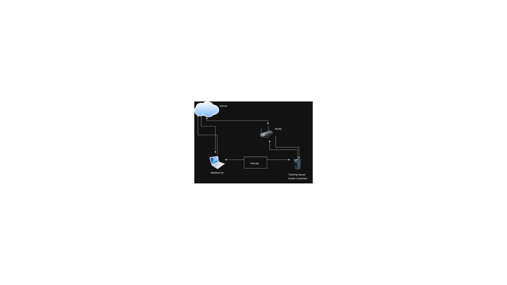

# 🚀 My Home Lab Journey: Day 1 - Infrastructure Setup

This repository documents my daily progress in building a professional-grade home lab for **DevOps** and **LLMOps**. My goal is to bridge my ICT undergraduate studies with real-world AI Infrastructure Architecture.

## 📅 Today's Progress (April 18, 2026)

### 1. 🏗️ Infrastructure Decision
After evaluating Proxmox vs. Bare-Metal Ubuntu vs. Cloud labs, I decided on **Bare-Metal Ubuntu 24.04 LTS**.
- **Reasoning:** Maximum performance for local LLM inference (Ollama) and high efficiency for my SaaS projects like *InvoiceMarshal*.
- **Hardware:**
  - **Server:** ThinkPad (Ubuntu Server 24.04 LTS)
  - **Workstation:** MacBook Air (Management & Development)

### 2. 🌐 Network Architecture & Connectivity
I designed a secure network layout to manage my server remotely.
- **Connectivity:** Implemented **Tailscale** to create a secure peer-to-peer mesh VPN. This allows me to SSH into my ThinkPad securely from the University of Vavuniya or any external network.
- **Diagram:**
  

### 3. 🧠 Learning & Research
- **Video Study:** Completed a session on Home Server optimization for DevOps.
- **Key Takeaways:**
  - The "Containerize Everything" strategy to keep the host OS clean.
  - Resource monitoring for AI workloads (RAM/CPU).

## 🛠️ Tech Stack Used Today
- **OS:** Ubuntu 24.04 LTS
- **Networking:** Tailscale (WireGuard-based)
- **Diagramming:** Excalidraw
- **Documentation:** Obsidian & GitHub

## 🎯 Next Steps
- [ ] Execute my custom Linux Hardening Script on the ThinkPad.
- [ ] Set up Docker and Portainer for container management.
- [ ] Install Ollama and test the local API endpoint from my MacBook.

---
*Follow my journey as I transition from an ICT student to an AI Infrastructure Architect.*